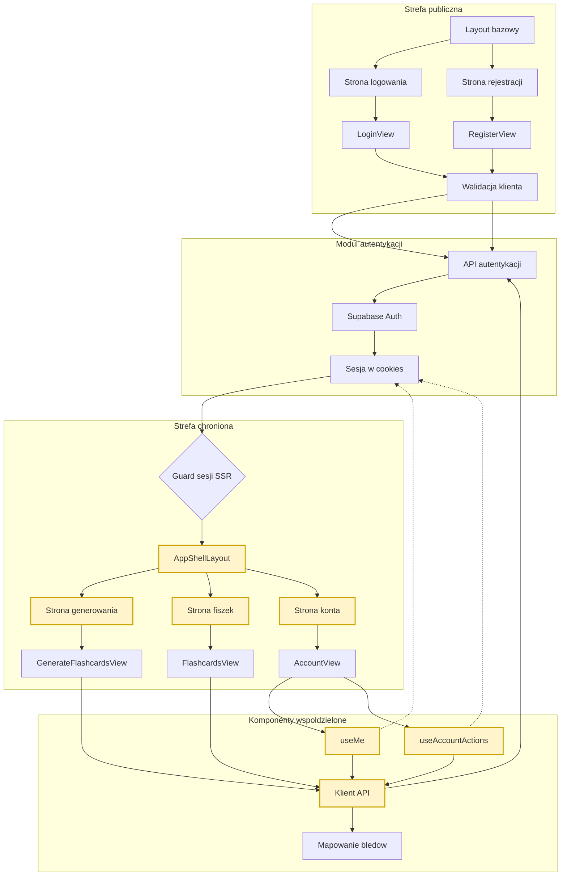

<architecture_analysis>
1. Komponenty z referencji (PRD + auth-spec):
   - Layouty: Layout.astro, AppShellLayout.astro, (opcjonalnie) PublicLayout.astro.
   - Strony Astro: Strona logowania, Strona rejestracji, Strona generowania, Strona fiszek, Strona konta.
   - Komponenty React: LoginView, RegisterView, AccountView.
   - Hooki i moduły stanu: useMe, useAccountActions.
   - Warstwa API: API autentykacji, API aplikacji, klient API (fetch).
   - Moduly auth: sesja w cookies, Supabase Auth.

2. Glowne strony i odpowiadajace komponenty:
   - Strona logowania -> LoginView.
   - Strona rejestracji -> RegisterView.
   - Strony chronione -> AppShellLayout + odpowiedni widok React.

3. Przeplyw danych:
   - LoginView/RegisterView -> walidacja klienta -> API autentykacji -> Supabase Auth -> cookies.
   - Guard SSR czyta cookies i kieruje do strefy chronionej lub logowania.
   - Widoki chronione uzywaja hookow useMe/useAccountActions i klienta API do komunikacji z API aplikacji.

4. Opis funkcjonalnosci komponentow:
   - LoginView/RegisterView: formularze, walidacja, obsluga bledow, redirect po sukcesie.
   - AppShellLayout: nawigacja w strefie auth oraz punkt wylogowania.
   - useMe: pobiera dane biezacego uzytkownika i obsluguje 401.
   - useAccountActions: wylogowanie oraz usuwanie konta.
   - Guard SSR: wstepna kontrola sesji przed renderem stron chronionych.
</architecture_analysis>

<mermaid_diagram>

</mermaid_diagram>
